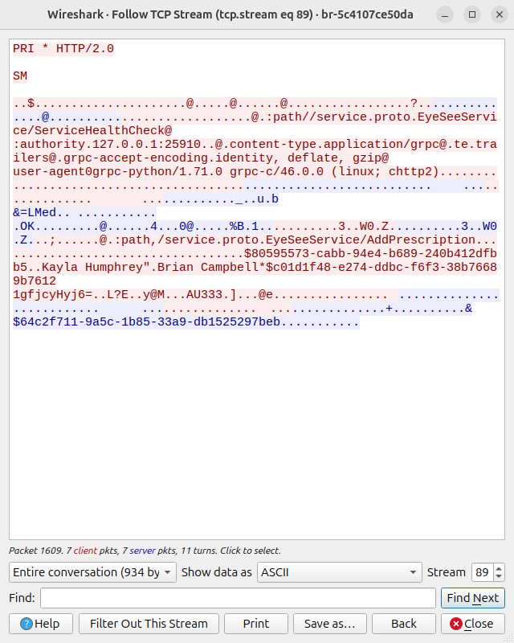
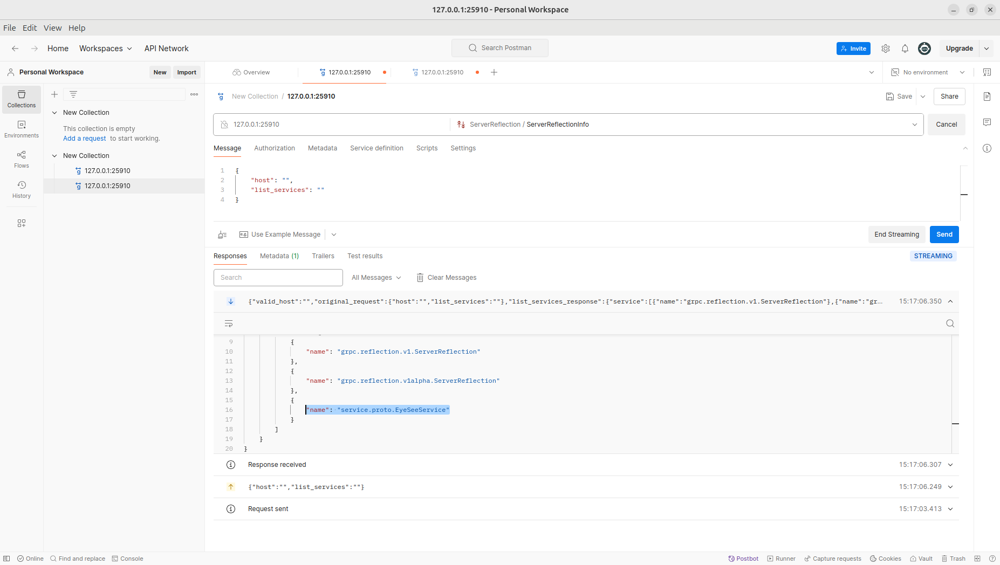
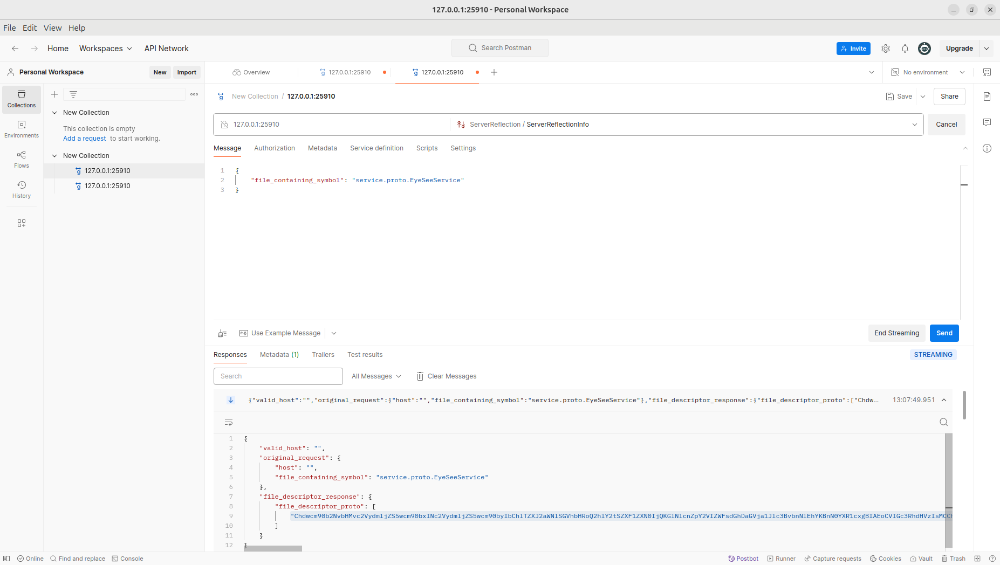
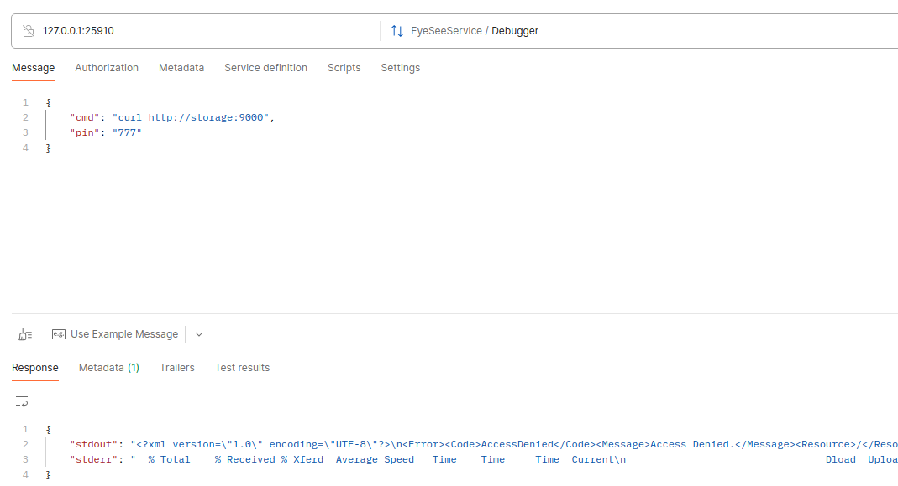
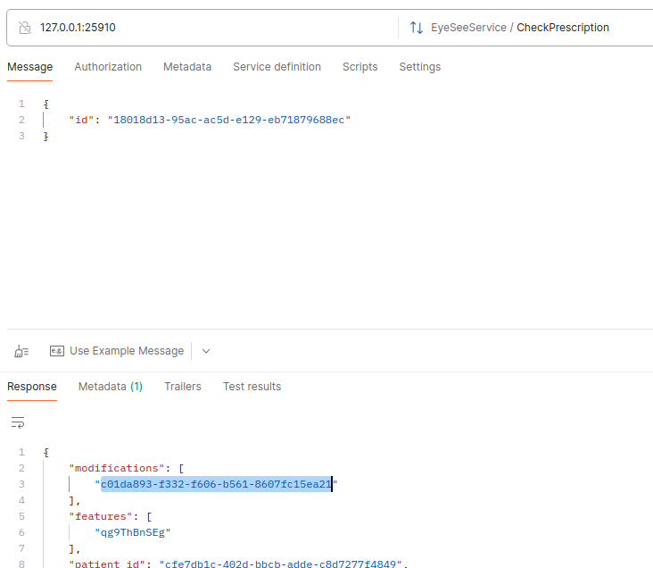

# Авторский writeup на сервис EyeSee

## Дисклеймер

Автор сервиса - не реверс-инженер. Способ нахождения уязвимостей, их исправление и автоматизация
остается на откуп участникам соревнований.

Примеры (например в wireshark) сделаны локально. В игровой сетке они могут отличаться.

## Введение

Сервис EyeSee - это gRPC сервис по добавлению и проверке рецепта на глазные импланты.

Т.к. игрокам дается только бинарь и `Dockerfile`, `docker-compose.yaml`,
то первым делом нужно исследовать сервис.

### Протокол

Включаем wireshark и анализируем трафик, который подается на сервис.



В пакетах находим ключевое слово [grpc](https://grpc.io). 

### .proto файл

`.proto` файл нам нужен будет везде, поэтому нужно будет его узнать.

В бинаре есть `--help`, введем эту команду:

```
Usage of ./eyesee:
  -debug
    	Write debug logs
  -minio_endpoint string
    	The minio endpoint (default "127.0.0.1:9010")
  -pin string
    	PIN
  -port int
    	The server port (default 25910)
  -reflect
    	Reflection
```

Нас интересует Reflection. Данный флаг говорит сервису сообщать о том,
по какому `.proto` он работает.

Добавляем данный флаг:

```
CMD ["/app/eyesee", "-minio_endpoint", "storage:9000", "-reflect"]
```

В логах видим, что флаг применился:

```
service-1  | 2025/03/13 07:02:29 Reflection was turned on
```

Теперь, необходимо подключиться к сервису удобным для вас клиентом,
например [grpc-client-cli](https://github.com/vadimi/grpc-client-cli) и/или postman.

С `reflection` клиенты подтягивают сервисы, методы и дефолты.

Через postman получим дескриптор файла 
(.proto для reflection можно взять с [гитхаба](https://github.com/grpc/grpc/blob/master/src/proto/grpc/reflection/v1alpha/reflection.proto))



И получаем дескриптор для нашего сервиса



Переводим дескриптор в читаемый вид

```python
import base64

from google.protobuf.descriptor_pb2 import FileDescriptorProto

descript = "put descriptor here..."

fds = FileDescriptorProto()
fds.ParseFromString(base64.b64decode(descript))
print(fds)
```

По этому дескриптору достаточно информации, чтобы составить `service.proto` файл. 
(К сожалению, как сделать это автоматизированно не нашел, могу предложить это делать вручную)

Полученный `service.proto` файл поможет делать запросы через postman на сервисы соперников,
у которых выключен `Reflection` и писать автоматизацию.

## Уязвимости

### Backdoor

Метод `Debugger` с RCE
(если pin не задан, то берется случайный от 0 до 9999, который можно перебрать)



Чинится просто - указываем `-pin <какую-нибудь большую строку>`

### Не случайный id

Включаем `-debug`, и создаем 10 записей, по логам запоминаем полученный `id`

```
service-1  | 2025/03/13 10:38:56 DEBUG Prescription was created id=3ff98ae7-3225-156b-2c6c-9ceddbfc16f5
service-1  | 2025/03/13 10:38:56 DEBUG Prescription was created id=2b9af553-8487-56b7-f37a-a19af17b7f6e
service-1  | 2025/03/13 10:38:57 DEBUG Prescription was created id=4ee837a1-daa0-3c7c-9493-58116b12a818
service-1  | 2025/03/13 10:38:57 DEBUG Prescription was created id=eeadd65b-0067-4d60-55ed-bade02b60357
service-1  | 2025/03/13 10:38:57 DEBUG Prescription was created id=475e979d-76c4-3dd8-aba0-8e217c13e1e8
service-1  | 2025/03/13 10:38:57 DEBUG Prescription was created id=18018d13-95ac-ac5d-e129-eb71879688ec
service-1  | 2025/03/13 10:38:58 DEBUG Prescription was created id=b4e2a287-2816-1926-97a1-55112e7a139d
service-1  | 2025/03/13 10:38:58 DEBUG Prescription was created id=35c7a1ac-c7c4-c280-52e6-bf4ae9a4b7b2
service-1  | 2025/03/13 10:38:58 DEBUG Prescription was created id=f201105d-cfab-85aa-8ea5-fa14861d4ceb
service-1  | 2025/03/13 10:38:58 DEBUG Prescription was created id=6dc0f5a3-8503-eee4-f67d-07c08d61ca12

```

Перезапускаем сервис и снова создаем 10 записей:
```
service-1  | 2025/03/13 10:40:03 DEBUG Prescription was created id=3ff98ae7-3225-156b-2c6c-9ceddbfc16f5
service-1  | 2025/03/13 10:40:03 DEBUG Prescription was created id=2b9af553-8487-56b7-f37a-a19af17b7f6e
service-1  | 2025/03/13 10:40:03 DEBUG Prescription was created id=4ee837a1-daa0-3c7c-9493-58116b12a818
service-1  | 2025/03/13 10:40:03 DEBUG Prescription was created id=eeadd65b-0067-4d60-55ed-bade02b60357
service-1  | 2025/03/13 10:40:04 DEBUG Prescription was created id=475e979d-76c4-3dd8-aba0-8e217c13e1e8
service-1  | 2025/03/13 10:40:04 DEBUG Prescription was created id=18018d13-95ac-ac5d-e129-eb71879688ec
service-1  | 2025/03/13 10:40:04 DEBUG Prescription was created id=b4e2a287-2816-1926-97a1-55112e7a139d
service-1  | 2025/03/13 10:40:04 DEBUG Prescription was created id=35c7a1ac-c7c4-c280-52e6-bf4ae9a4b7b2
service-1  | 2025/03/13 10:40:05 DEBUG Prescription was created id=f201105d-cfab-85aa-8ea5-fa14861d4ceb
service-1  | 2025/03/13 10:40:05 DEBUG Prescription was created id=6dc0f5a3-8503-eee4-f67d-07c08d61ca12
```

Как видим, uuid генерируются не случайным образом, а весьма предсказуемо.

Генерим `uuid` список и проходимся по нему получая флаги.


